# Drone Detection, Tracking and Trajectory Prediction
## System Architecture and Flowcharts

## Overview

A real-time pipeline that detects drones in a camera feed, tracks each one across frames, and forecasts its path 1 to 2 seconds ahead. It runs at about 48 fps on a laptop.

- **Detect**: find drone-sized objects in every frame
- **Track**: hold a stable identity per drone
- **Predict**: forecast where each drone is heading

**Scope.** The diagrams show the full fielded design (multi-camera EO/IR, edge hardware, fusion). The prototype implements the detect-track-predict core on a single video. Solid arrows are data flow; dashed arrows are feedback.

## Diagram 1: System Context

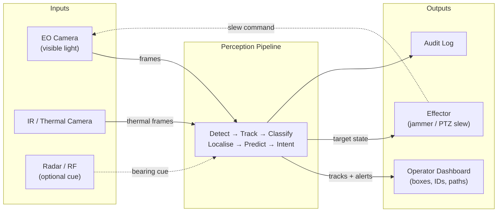

Sensors feed the pipeline; it outputs tracks, alerts, and cueing. The prototype uses one EO video; the rest is the production system around it.

## Diagram 2: End-to-End Pipeline

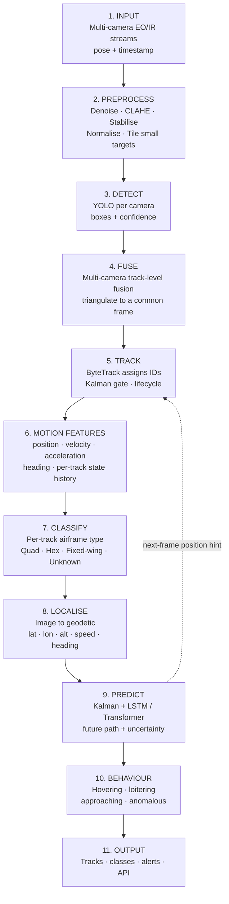

The eleven stages from input to output. The dashed arrow feeds the predictor's next-frame estimate back to the tracker. The prototype implements detection (3), tracking (5), motion-feature extraction (6) and prediction (9) in a single-camera, image-coordinate form; fusion (4), classification (7), localisation (8) and behaviour (10) are production stages, detailed under Production-Grade Extensions.

## Diagram 3: Detection Stage

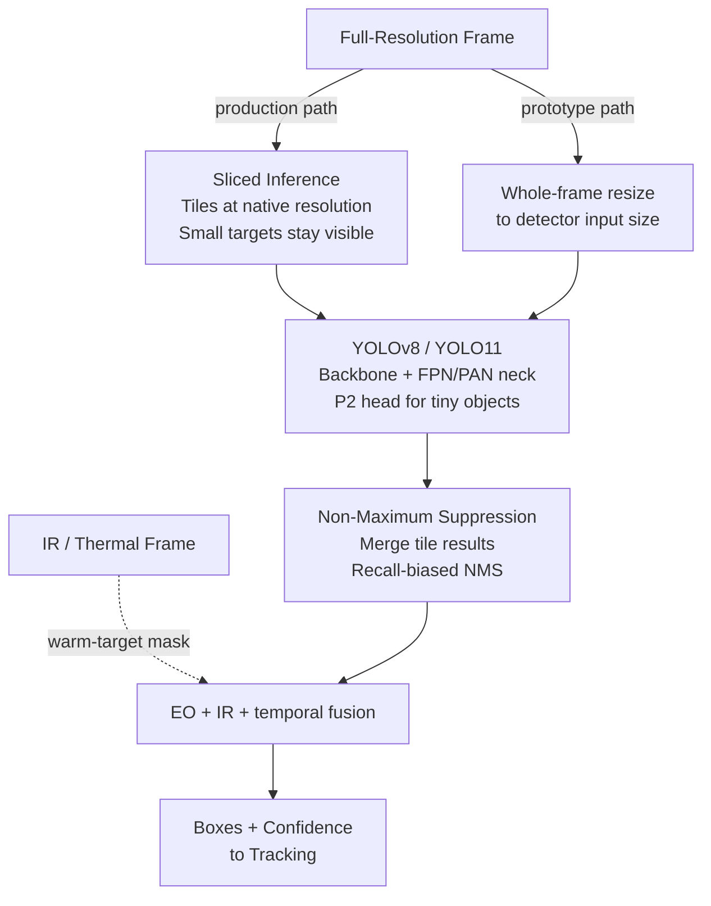

Sliced inference and a P2 head keep small targets detectable. NMS is biased toward recall, because a detection dropped here cannot be recovered downstream. The prototype runs whole-frame YOLO.

## Diagram 4: Tracking Stage (ByteTrack)

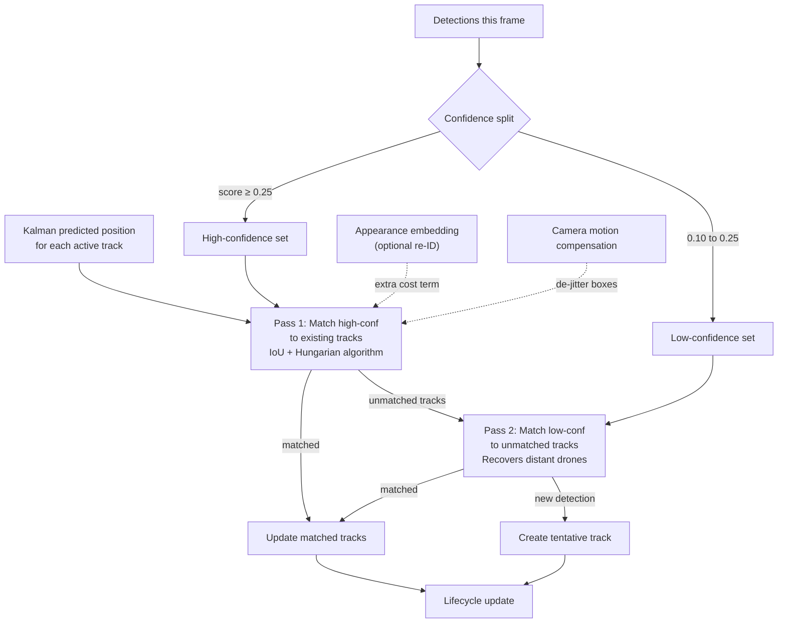

Pass 2 matches the low-confidence boxes other trackers discard, which is where faint, distant drones appear.

## Diagram 5: Track Lifecycle

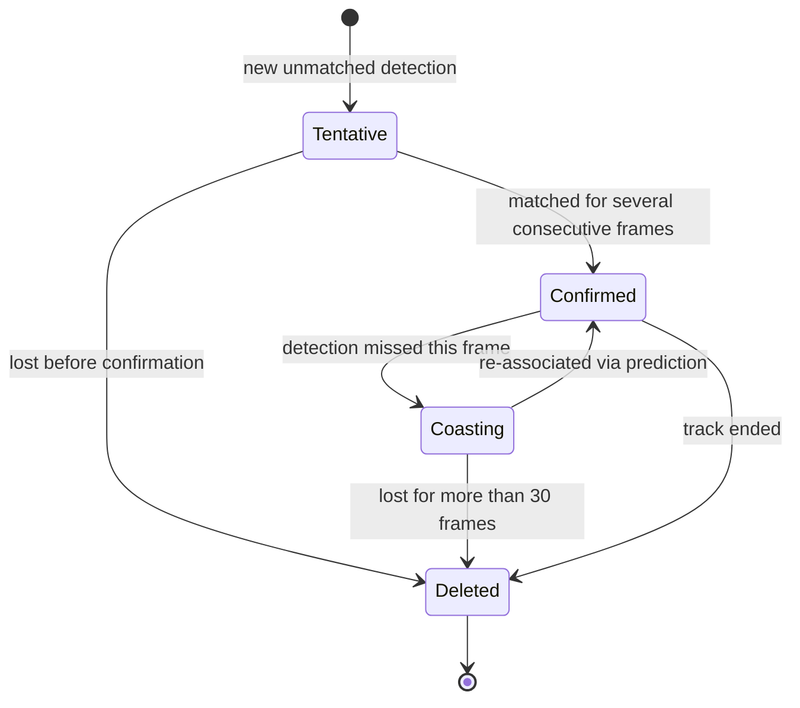

A track must persist several frames to be Confirmed, which filters one-frame false alarms. Coasting holds a track's identity for up to 30 frames through brief occlusion.

## Diagram 6: Prediction Stage

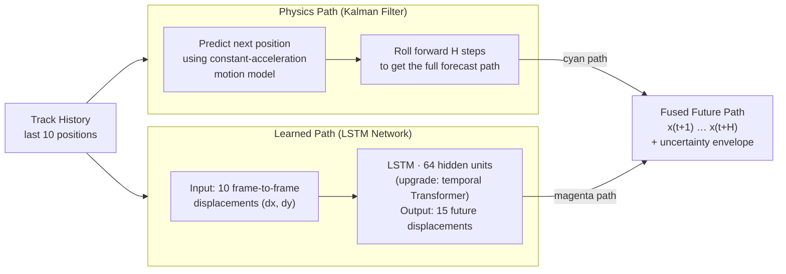

Two forecasts run in parallel: the Kalman filter (physics, stable) and the LSTM (learned, follows manoeuvres). Production upgrade: a temporal Transformer for swarms and longer horizons, with the filter as the deterministic anchor.

## Diagram 7: Input Pipeline and Sensor Synchronisation

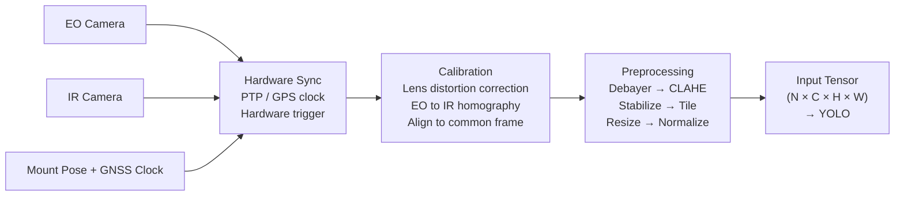

Hardware-synchronised EO/IR, calibrated and registered, then preprocessed into the input tensor. The prototype runs resize and normalise only.

## Diagram 8: Deployment Architecture

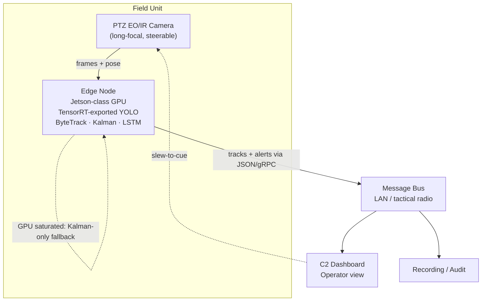

An edge node (Jetson-class, TensorRT) feeds a message bus to command-and-control. Degraded mode: if the GPU saturates, the Kalman filter runs alone rather than stalling.

## Latency Budget

End-to-end per-frame timing (Apple M3, YOLOv8n at 640 px, 432-frame average):

| Stage | Time |
|---|---|
| Capture + preprocess | ~1.0 ms |
| YOLO detect | ~6.4 ms |
| ByteTrack + Kalman | ~1.0 ms |
| LSTM predict | ~1.0 ms |
| Draw + encode | ~11.0 ms |
| **End-to-end** | **~20.9 ms (47.9 FPS)** |

The 30 fps budget is 33 ms, leaving about 12 ms of headroom for EO/IR fusion and tiling in production.

## Production-Grade Extensions

The stages below take the core pipeline from a working demo toward a fielded system. They are part of the architecture, not the prototype code.

### Diagram 10: Multi-Camera Fusion

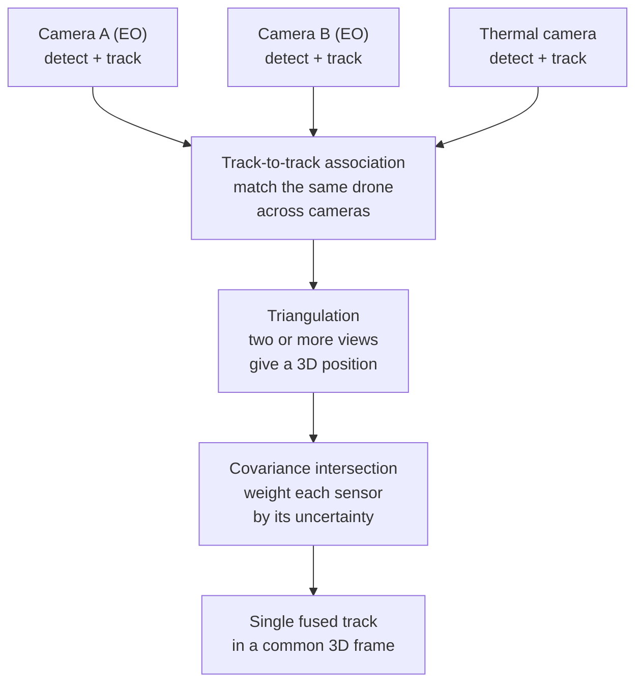

Late, track-level fusion across separated cameras. Triangulation recovers 3D position; covariance intersection weights each sensor by its uncertainty.

### Diagram 11: Target Classification

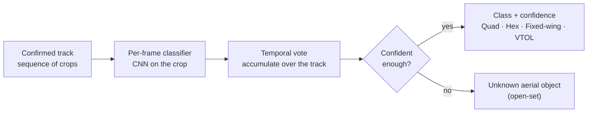

Classification runs per track, not per frame: a temporal vote builds confidence. An open-set unknown class flags unfamiliar airframes instead of mislabelling them.

### Diagram 12: World-Coordinate Estimation

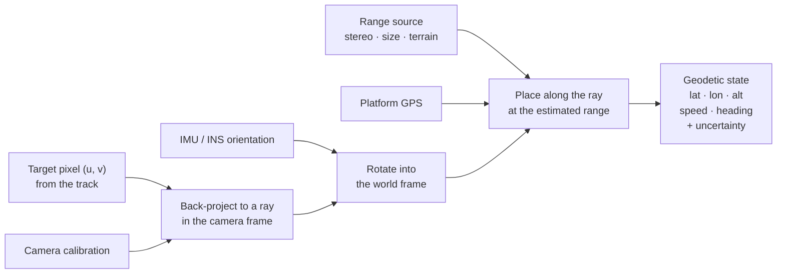

Pixel to geodetic state using calibration, GPS, INS and a range source. Range is the hard part for one camera; the output carries an uncertainty ellipse. This is the largest gap between prototype and deployment.

### Diagram 13: Behaviour and Intent Analysis

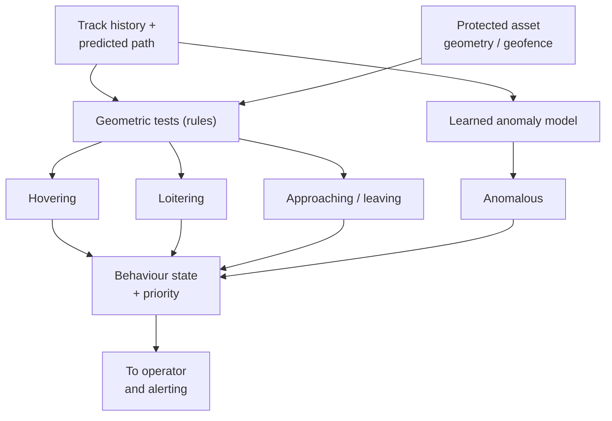

Hovering, loitering and approach are deterministic geometric rules against the protected asset; anomalous behaviour uses a learned model of normal traffic.

## Summary Table

| Diagram | Shows | Prototype |
|---|---|---|
| 1: System context | Sensors in, outputs out | Pipeline only |
| 2: End-to-end pipeline | All 10 stages | Stages 3, 5, 8 |
| 3: Detection | YOLO, small-target strategy, NMS | Whole-frame YOLO |
| 4: Tracking | ByteTrack two-pass association | Implemented |
| 5: Track lifecycle | Tentative, Confirmed, Coasting | Implemented |
| 6: Prediction | Kalman + LSTM (upgrade: Transformer) | Implemented |
| 7: Input pipeline | Sensor sync, calibration, preprocess | Resize/normalise |
| 8: Deployment | Edge node, bus, degraded mode | Design only |
| 10: Multi-camera fusion | Track-level fusion, triangulation | Design only |
| 11: Classification | Per-track airframe type, unknown class | Design only |
| 12: World coordinates | Image to geodetic, with uncertainty | Design only |
| 13: Behaviour / intent | Hover, loiter, approach, anomaly | Design only |
