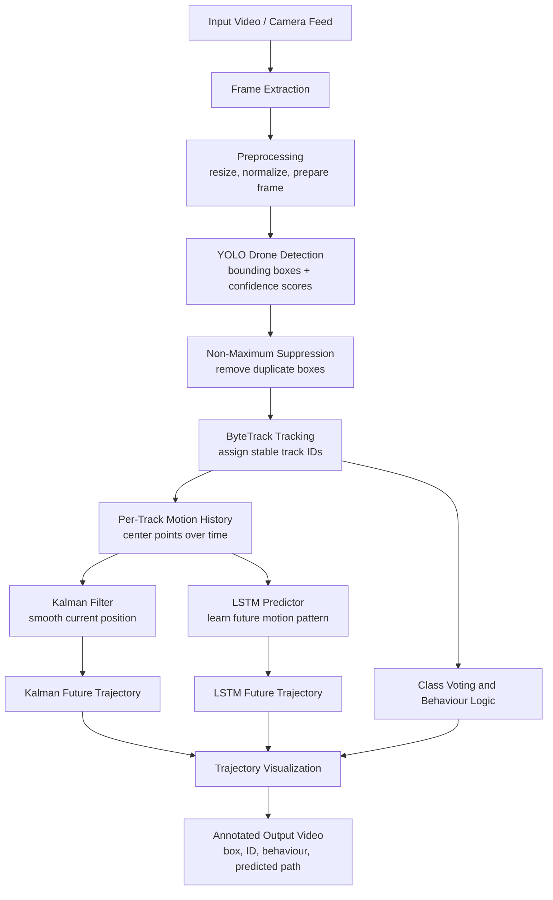

# Drone Detection, Tracking and Trajectory Prediction
## Project File: Architecture, Pseudocode and Implementation Explanation

---

## 1. Project Overview

This project implements a real-time drone perception pipeline. The goal is to detect drones in video, maintain a stable identity for each detected drone, track its motion over time, and predict its future trajectory.

The implemented system follows this core flow:

```text
Input Video -> YOLO Detection -> ByteTrack Tracking -> Motion History
            -> Kalman Filter + LSTM Prediction -> Annotated Output Video
```

The same architecture can be upgraded into a production-grade real-time system using edge hardware, calibrated cameras and optimized deployment formats such as ONNX or TensorRT.

---

## 2. Dataset Source

The drone detection dataset was collected from **Roboflow** in YOLO format. The dataset contains labelled images for drone detection and is used to fine-tune a YOLO detector because the default COCO-trained YOLO model does not contain a dedicated `drone` class.

This is important because a stock YOLO model may classify drones as similar-looking objects such as birds, kites or airplanes. Fine-tuning on the Roboflow drone dataset allows the detector to learn drone-specific visual features.

---

## 3. Architecture Pipeline Diagram



---

## 4. Implemented Code Architecture

The implemented system is a working prototype of the detect-track-predict pipeline.

### 4.1 Input and Frame Processing

The system accepts an input video or video stream. Each frame is read sequentially and passed into the detection stage. The frame is prepared for the detector by resizing and converting it into the format expected by YOLO.

### 4.2 Drone Detection Using YOLO

YOLO is used as the object detector because it is fast and suitable for real-time applications. It detects candidate objects in each frame and returns:

- bounding box coordinates
- confidence score
- predicted class

For the project requirement, YOLO must be fine-tuned using the Roboflow drone dataset. Once fine-tuned, the model can detect drones more accurately than a generic pretrained model.

### 4.3 Tracking Using ByteTrack

After detection, ByteTrack links detections across frames. This gives each detected drone a stable tracking ID. Tracking is necessary because detection alone only finds objects frame by frame; it does not know whether an object in the next frame is the same drone.

ByteTrack is useful because it can also use lower-confidence detections to keep a track alive. This is helpful for drones because distant drones may appear small and uncertain.

The tracker output contains:

- current bounding box
- stable track ID
- current frame position
- track continuity across frames

### 4.4 Motion History Extraction

For each tracked drone, the system stores the center point of the bounding box over time.

```text
center_x = (x1 + x2) / 2
center_y = (y1 + y2) / 2
```

This produces a trajectory history:

```text
[(x1, y1), (x2, y2), (x3, y3), ...]
```

This history is the foundation for trajectory tracking and future path prediction.

### 4.5 Kalman Filter Prediction

A constant-acceleration Kalman filter is used to smooth noisy detections and predict short-term future motion.

The Kalman filter tracks:

- position
- velocity
- acceleration

It is useful because video detections are noisy. The drone may be detected slightly differently in each frame, so the Kalman filter creates a smoother and more physically stable trajectory.

In the output video, the Kalman predicted path is drawn as a future trajectory line.

### 4.6 LSTM Trajectory Prediction

The LSTM model predicts future motion using recent movement history. Instead of only using physics, it learns motion patterns from trajectories.

The LSTM receives recent frame-to-frame displacements:

```text
(dx, dy) over the last K frames
```

It predicts future displacements for the next H frames. This helps the system handle non-linear drone movement such as turns, acceleration and curved paths.

The LSTM prediction is drawn as a future path with uncertainty visualization.

### 4.7 Behaviour Labelling

The implemented system also applies simple behaviour logic using speed and bounding-box area changes.

Examples:

- low speed for many frames -> hover or loiter
- increasing box area -> approach
- decreasing box area -> depart
- otherwise -> transit

This is a lightweight rule-based behaviour module suitable for demonstration.

### 4.8 Output Video

The final output video shows:

- detected object bounding box
- tracking ID
- class label
- behaviour label
- Kalman predicted trajectory
- LSTM predicted trajectory
- uncertainty rings
- real-time FPS information

This proves that the implemented code performs detection, tracking and trajectory prediction end to end.

---

## 5. Production-Grade Pseudocode

```text
Algorithm: Real-Time Drone Detection, Tracking and Trajectory Prediction

Input:
    video stream or camera feed
    trained YOLO drone detector
    ByteTrack tracker
    Kalman filter module
    trained LSTM trajectory model
    prediction horizon H

Output:
    annotated video stream
    confirmed drone tracks
    predicted future trajectory for each drone

Initialise:
    load trained YOLO detector
    load tracking module
    load LSTM model if available
    create empty track history storage
    create empty Kalman filter storage
    create empty alert storage

For each frame in the input stream:

    1. Read current frame

    2. Preprocess frame
        resize frame
        normalize image
        prepare detector input

    3. Run YOLO detection
        detections = YOLO(frame)
        keep detections above confidence threshold
        remove duplicate boxes using NMS

    4. Run ByteTrack association
        match detections with existing tracks
        assign stable track IDs
        create new tracks for unmatched valid detections
        remove tracks missing for too many frames

    5. For each active track:
        compute bounding-box center
        append center point to track history

    6. Update Kalman filter:
        if track is new:
            initialise Kalman filter
        else:
            predict current state
            correct state using detected center point
        generate future Kalman trajectory for H frames

    7. Run LSTM prediction:
        if enough history points are available:
            convert recent positions into displacement sequence
            predict future displacement sequence
            convert displacement output into future coordinates
        else:
            use Kalman-only prediction

    8. Estimate behaviour:
        compute speed from track motion
        compare recent bounding-box area trend
        assign behaviour label:
            hover, loiter, approach, depart or transit

    9. Generate alert:
        if track is confirmed and alert not already raised:
            mark drone as confirmed
            raise alert event

    10. Draw output:
        draw bounding box
        draw track ID
        draw class label
        draw behaviour label
        draw Kalman future path
        draw LSTM future path
        draw uncertainty region
        draw FPS information

    11. Save or display annotated frame

End For

Return:
    final annotated video
    trajectory information for each tracked drone
```

---

## 6. Production-Grade Real-Time Architecture

The production-grade version is the architecture that would be used in a real field system with proper hardware.

### 6.1 Production Hardware Setup

A real-time deployment would use:

- high-resolution EO camera
- optional thermal camera
- edge GPU device
- calibrated camera parameters
- synchronized timestamping
- optimized detector format
- real-time alert interface

The detector would be exported to an optimized runtime such as TensorRT or ONNX. This reduces latency and allows the system to run reliably on edge hardware.

### 6.2 Production Pipeline

```text
Camera Feed
    -> Edge Preprocessing
    -> Optimized YOLO Drone Detector
    -> Multi-Object Tracker
    -> Kalman / IMM Motion Filter
    -> LSTM or Transformer Predictor
    -> World Coordinate Mapping
    -> Alert and Command Interface
```

### 6.3 Production Capabilities

The production-grade system would support:

- real-time camera input
- drone detection at long distance
- stable multi-drone tracking
- trajectory prediction 1 to 2 seconds ahead
- uncertainty-aware prediction
- hardware acceleration
- graceful fallback if GPU load is high
- integration with alerting or command systems

### 6.4 Production Upgrades Beyond Current Code

The current implementation works in image coordinates. A production system would add:

- camera calibration
- world-coordinate conversion
- multi-camera fusion
- thermal or radar support
- stronger drone classifier
- tracking metrics using ground-truth track data
- TensorRT or ONNX deployment
- hardware-level latency monitoring

---

## 7. What We Implemented According to Available Resources

Because this project is implemented with available dataset and local compute resources, the current system focuses on the core working pipeline.

Implemented in the current code:

- video input processing
- YOLO-based detection
- ByteTrack-based object tracking
- per-track center history
- Kalman filter smoothing and prediction
- LSTM-based future trajectory prediction
- behaviour labelling using simple motion rules
- alert generation after track confirmation
- annotated output video generation
- FPS and latency display

Not fully implemented due to resource and hardware limits:

- real-time camera hardware integration
- TensorRT deployment
- calibrated world-coordinate output
- multi-camera fusion
- radar or thermal sensor fusion
- full production command-and-control integration

This means the code demonstrates the main machine learning and tracking architecture, while the production-grade version describes how the same pipeline would be deployed in a real hardware system.

---

## 8. Working Explanation of the Full Pipeline

When the video starts, each frame is sent to the YOLO detector. YOLO finds possible drones and gives bounding boxes. These detections are passed to ByteTrack, which connects detections frame by frame and assigns a stable ID.

For every tracked drone, the system calculates the center of the bounding box. These center points are stored as the drone's motion history. The Kalman filter uses this history to estimate smooth position, velocity and acceleration. This gives a stable short-term future trajectory.

At the same time, the LSTM model uses recent movement patterns to predict the future path. This is useful when the drone does not move in a simple straight line. The Kalman filter gives a physically stable prediction, while the LSTM helps with curved or non-linear motion.

The final output combines all information and draws it on the video. The user can see the detected drone, its ID, its behaviour and its predicted future movement.

This is why the architecture can track the trajectory of a drone: it does not only detect the drone in one frame, but stores its motion over many frames and predicts where it will go next.

---

## 9. Final Summary

This project implements a complete drone perception pipeline:

```text
Detect -> Track -> Extract Motion -> Predict Trajectory -> Visualize Output
```

The implemented code demonstrates the core architecture using available resources. The production-grade design extends the same concept to real-time hardware with optimized inference, calibrated sensors and deployment-ready alerting.

The most important requirement for strong output quality is a trained YOLO drone detector. Once training produces a good detector, the tracking and trajectory prediction modules can operate on drone-specific detections and generate the expected final output.
